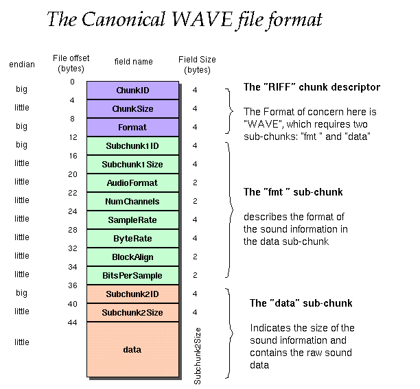

# WAVE_FORMAT_PCM用法

除非安装特殊软件，否则Windows只提供`WAVE_FORMAT_PCM`一种数据格式，即脉冲编码格式，本文的音
频数据格式基于此。

[TOC]

## 重要参数

声音的录入有三个重要的参数：

* 声道数: 可以是单声道或者双声道。
* 采样频率: 一秒内对声音信号的采集次数，常用的有8kHz，32kHz，48kHz，11.025kHz，22.05kHz，44.1kHz。
* 量化位数: 用多少bit表达一次采样所采集的数据，通常有8bit、16bit、24bit和32bit等几种。

## `WAVEFORMATEX`结构

```C++
typedef struct tWAVEFORMATEX {
  WORD  wFormatTag;
  WORD  nChannels;
  DWORD nSamplesPerSec;
  DWORD nAvgBytesPerSec;
  WORD  nBlockAlign;
  WORD  wBitsPerSample;
  WORD  cbSize;
} WAVEFORMATEX, *PWAVEFORMATEX, *NPWAVEFORMATEX, *LPWAVEFORMATEX;
```

* wFormatTag: 除非安装特殊软件，否则始终是`WAVE_FORMAT_PCM`。
* nChannels: 上文的通道数，单声道为1，双声道为2。
* nSamplesPerSec: 上文的采样率。
* wBitsPerSample: 上文的量化位数，wFormatTag为WAVE_FORMAT_PCM时，为8或者16。
* nBlockAlign: 每次采样的字节数（对齐块），通过$nChannels * wBitsPerSample / 8$计算。
* nAvgBytesPerSec: 每秒采样的字节数，通过$nChannels * wBitsPerSample * nSamplesPerSec / 8$计算。
* cbSize: wFormatTag为WAVE_FORMAT_PCM时，忽略此参数。

## `AVSampleFormat`

```C++
enum AVSampleFormat {
    AV_SAMPLE_FMT_NONE = -1,
    AV_SAMPLE_FMT_U8,          ///< unsigned 8 bits
    AV_SAMPLE_FMT_S16,         ///< signed 16 bits
    AV_SAMPLE_FMT_S32,         ///< signed 32 bits
    AV_SAMPLE_FMT_FLT,         ///< float
    AV_SAMPLE_FMT_DBL,         ///< double

    AV_SAMPLE_FMT_U8P,         ///< unsigned 8 bits, planar
    AV_SAMPLE_FMT_S16P,        ///< signed 16 bits, planar
    AV_SAMPLE_FMT_S32P,        ///< signed 32 bits, planar
    AV_SAMPLE_FMT_FLTP,        ///< float, planar
    AV_SAMPLE_FMT_DBLP,        ///< double, planar
    AV_SAMPLE_FMT_S64,         ///< signed 64 bits
    AV_SAMPLE_FMT_S64P,        ///< signed 64 bits, planar

    AV_SAMPLE_FMT_NB           ///< Number of sample formats. DO NOT USE if linking dynamically
};
```

ffmpeg中音频数据有Packed和Planar两种存储方式，使用`WAVE_FORMAT_PCM`格式录音产生的数据对应
Packed存储方式，两种存储方式如下：

* Packed: L R L R L R, `AVFrame`中的data[0]存放所有音频数据。
* Planar: L L L R R R,`AVFrame`中的data[i]或者extended_data[i]依次存放第i个声道数据（假
设声道0是第一个）；如果声道数超过8个，需要从extended_data获取声道数据。

## WAV音频文件格式

WAVE文件是非常简单的一种RIFF文件，它的格式类型为“WAVE”。RIFF包含两个子块，ID分别是“fmt”和
“data”，其中“fmt”子块由`PcmWaveFormat`所组成，其子块的大小就是`sizeof(PcmWaveFormat)`，
数据组成就是`PcmWaveFormat`结构中的数据。

WAV文件格式大致如下：

| |
| - |
| 标志符（"RIFF"） |
| 文件大小 |
| 格式类型（"WAVE"） |
| "fmt" |
| sizeof(PcmWaveFormat) |
| PcmWaveFormat |
| "data" |
| 声音数据大小 |
| 声音数据 |



C++代码定义如下：

```C++
struct WAV_RIFF {
  // 固定值，{'R', 'I', 'F', 'F'}
  char chunk_id[4];
  // 文件大小(36 + sizeof(WAV_DATA))
  uint32_t chunk_size;
  // 固定值，{'W', 'A', 'V', 'E'}
  char format[4];
};

struct WAV_FMT {
  // 固定值，{'f', 'm', 't', '\0'}
  char sub_chunk1_id[4],
  // PCM下是固定值 - 16
  uint32_t sub_chunk1_size,

  // 音频格式，PCM下是固定值 - 1
  uint16_t audio_format,
  // 声道数，单声道（Mono）是1，双声道（Stereo）是2
  uint16_t num_channels,
  // 每秒采样数
  uint32_t samples_per_sec,
  // 每秒采集的数据的字节数，samples_per_sec * num_channels * bits_per_sample / 8
  uint32_t byte_per_sec,
  // 每次采样的字节数，num_channels * bits_per_sample / 8
  uint16_t block_align,
  // 每次采样的bit数，PCM时为8或16
  uint16_t bits_per_sample,
};

struct WAV_DATA {
  // 固定值，{'d', 'a', 't', 'a'}
  char sub_chunk2_id[4];
  // 采集的数据的字节
  uint32_t sub_chunk2_size;
  // 采集的数据
  /* data */
};

struct WaveFormat {
  WAV_RIFF riff;
  WAV_FMT fmt;
  WAV_DATA data;
};
```

"data"子块包含WAVE文件的**数字化波形声音数据**，其存放格式依赖"fmt"子块指定的格式种类。在多
声道形况下，样本是交替出现的。采集声音数据格式如下：


